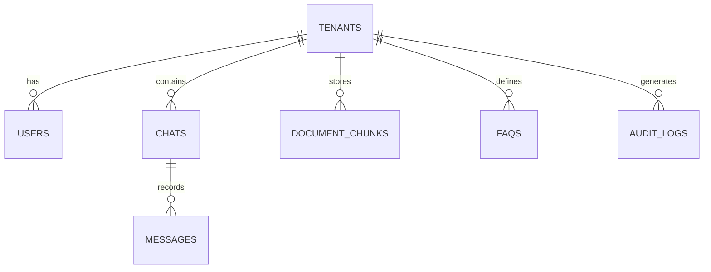

# Database Design

## Project: AI Employee Platform
**Document Version:** 1.0.0  
**Status:** Approved (SaaS Blueprint)  
**Author:** Senior SaaS Architect  
**Date:** July 6, 2026  

---

## 1. Entity Relationship Diagram (ERD)



---

## 2. Table Definitions

### 2.1 Tenants Table
Stores SaaS tenant (organization) information and credentials.

| Column Name | Type | Constraints | Description |
|-------------|------|-------------|-------------|
| `id` | UUID | PRIMARY KEY, DEFAULT uuid_generate_v4() | Unique tenant identifier |
| `name` | VARCHAR(255) | NOT NULL | Tenant organization name |
| `stripe_customer_id` | VARCHAR(255) | UNIQUE | Stripe customer reference |
| `stripe_subscription_status` | VARCHAR(50) | DEFAULT 'inactive' | Subscription status (inactive/active/canceled) |
| `meta_phone_number_id` | VARCHAR(100) | UNIQUE | Meta WhatsApp Business Phone Number ID |
| `meta_access_token` | TEXT | | Encrypted Meta System User Access Token |
| `system_prompt` | TEXT | | AI employee system configuration |
| `created_at` | TIMESTAMPTZ | DEFAULT CURRENT_TIMESTAMP | Tenant creation timestamp |
| `updated_at` | TIMESTAMPTZ | DEFAULT CURRENT_TIMESTAMP | Last update timestamp |

### 2.2 Users Table
Stores tenant admin and agent user accounts.

| Column Name | Type | Constraints | Description |
|-------------|------|-------------|-------------|
| `id` | UUID | PRIMARY KEY, DEFAULT uuid_generate_v4() | Unique user identifier |
| `tenant_id` | UUID | NOT NULL, REFERENCES tenants(id) ON DELETE CASCADE | Tenant association |
| `email` | VARCHAR(255) | NOT NULL, UNIQUE | User email address |
| `password_hash` | VARCHAR(255) | NOT NULL | Securely hashed password |
| `role` | VARCHAR(50) | DEFAULT 'agent', CHECK (role IN ('admin', 'agent')) | User role |
| `created_at` | TIMESTAMPTZ | DEFAULT CURRENT_TIMESTAMP | User creation timestamp |

### 2.3 Chats Table
Stores WhatsApp customer contact and conversation state.

| Column Name | Type | Constraints | Description |
|-------------|------|-------------|-------------|
| `id` | UUID | PRIMARY KEY, DEFAULT uuid_generate_v4() | Unique chat identifier |
| `tenant_id` | UUID | NOT NULL, REFERENCES tenants(id) ON DELETE CASCADE | Tenant association |
| `customer_phone` | VARCHAR(50) | NOT NULL | Customer WhatsApp number |
| `customer_name` | VARCHAR(100) | | Customer display name (from Meta) |
| `ai_active` | BOOLEAN | DEFAULT TRUE | AI response toggle state |
| `last_message_at` | TIMESTAMPTZ | DEFAULT CURRENT_TIMESTAMP | Last activity timestamp |
| `created_at` | TIMESTAMPTZ | DEFAULT CURRENT_TIMESTAMP | Chat creation timestamp |

**Unique Constraint:** `(tenant_id, customer_phone)`

### 2.4 Messages Table
Auditable chat history for all conversations.

| Column Name | Type | Constraints | Description |
|-------------|------|-------------|-------------|
| `id` | UUID | PRIMARY KEY, DEFAULT uuid_generate_v4() | Unique message identifier |
| `chat_id` | UUID | NOT NULL, REFERENCES chats(id) ON DELETE CASCADE | Chat association |
| `direction` | VARCHAR(10) | NOT NULL, CHECK (direction IN ('incoming', 'outgoing')) | Message direction |
| `sender_type` | VARCHAR(20) | NOT NULL, CHECK (sender_type IN ('customer', 'ai', 'human')) | Sender identity |
| `text_content` | TEXT | NOT NULL | Message text |
| `meta_message_id` | VARCHAR(255) | | Meta Cloud API message ID |
| `created_at` | TIMESTAMPTZ | DEFAULT CURRENT_TIMESTAMP | Message timestamp |

### 2.5 Document Chunks Table
RAG vector database for semantic search.

| Column Name | Type | Constraints | Description |
|-------------|------|-------------|-------------|
| `id` | UUID | PRIMARY KEY, DEFAULT uuid_generate_v4() | Unique chunk identifier |
| `tenant_id` | UUID | NOT NULL, REFERENCES tenants(id) ON DELETE CASCADE | Tenant association |
| `source_name` | VARCHAR(255) | NOT NULL | Original filename or URL |
| `content` | TEXT | NOT NULL | Chunk text content |
| `embedding` | VECTOR(1536) | NOT NULL | OpenAI text-embedding-3-small vector |
| `created_at` | TIMESTAMPTZ | DEFAULT CURRENT_TIMESTAMP | Chunk creation timestamp |

### 2.6 FAQs Table
Structured Q&A overrides for deterministic responses.

| Column Name | Type | Constraints | Description |
|-------------|------|-------------|-------------|
| `id` | UUID | PRIMARY KEY, DEFAULT uuid_generate_v4() | Unique FAQ identifier |
| `tenant_id` | UUID | NOT NULL, REFERENCES tenants(id) ON DELETE CASCADE | Tenant association |
| `question_pattern` | VARCHAR(512) | NOT NULL | Question pattern for matching |
| `answer_text` | TEXT | NOT NULL | Exact override answer |
| `created_at` | TIMESTAMPTZ | DEFAULT CURRENT_TIMESTAMP | FAQ creation timestamp |

### 2.7 Audit Logs Table
Immutable audit trail for configuration changes.

| Column Name | Type | Constraints | Description |
|-------------|------|-------------|-------------|
| `id` | UUID | PRIMARY KEY, DEFAULT uuid_generate_v4() | Unique log identifier |
| `tenant_id` | UUID | NOT NULL, REFERENCES tenants(id) ON DELETE CASCADE | Tenant association |
| `user_id` | UUID | REFERENCES users(id) ON DELETE SET NULL | User who performed action |
| `operation` | VARCHAR(100) | NOT NULL | Action performed |
| `entity_type` | VARCHAR(50) | NOT NULL | Affected entity type |
| `entity_id` | UUID | | Affected entity ID |
| `old_value` | TEXT | | Previous state (JSON) |
| `new_value` | TEXT | | New state (JSON) |
| `created_at` | TIMESTAMPTZ | DEFAULT CURRENT_TIMESTAMP | Log timestamp |

---

## 3. Relationships Summary

| Relationship | Type | Description |
|--------------|------|-------------|
| Tenants → Users | 1:N | One tenant has multiple users (admins/agents) |
| Tenants → Chats | 1:N | One tenant has multiple customer chats |
| Tenants → Document Chunks | 1:N | One tenant has multiple document chunks |
| Tenants → FAQs | 1:N | One tenant has multiple FAQ overrides |
| Tenants → Audit Logs | 1:N | One tenant has multiple audit logs |
| Chats → Messages | 1:N | One chat has multiple messages |

All tenant-specific tables include `tenant_id` foreign key with `ON DELETE CASCADE` to maintain referential integrity.

---

## 4. Indexes

### 4.1 Tenants Table
```sql
CREATE INDEX idx_tenants_meta_phone ON tenants(meta_phone_number_id);
CREATE INDEX idx_tenants_stripe ON tenants(stripe_customer_id);
```

### 4.2 Users Table
```sql
CREATE INDEX idx_users_tenant ON users(tenant_id);
CREATE INDEX idx_users_email ON users(email);
```

### 4.3 Chats Table
```sql
CREATE INDEX idx_chats_tenant_phone ON chats(tenant_id, customer_phone);
CREATE INDEX idx_chats_tenant ON chats(tenant_id);
CREATE INDEX idx_chats_last_message ON chats(last_message_at DESC);
```

### 4.4 Messages Table
```sql
CREATE INDEX idx_messages_chat ON messages(chat_id);
CREATE INDEX idx_messages_created ON messages(created_at DESC);
```

### 4.5 Document Chunks Table
```sql
CREATE INDEX idx_chunks_tenant ON document_chunks(tenant_id);
CREATE INDEX idx_chunks_embedding ON document_chunks USING hnsw (embedding vector_cosine_ops);
```

### 4.6 FAQs Table
```sql
CREATE INDEX idx_faqs_tenant ON faqs(tenant_id);
```

### 4.7 Audit Logs Table
```sql
CREATE INDEX idx_audit_tenant ON audit_logs(tenant_id);
CREATE INDEX idx_audit_created ON audit_logs(created_at DESC);
```
