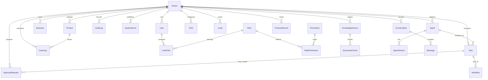

# AI Workforce — Architecture & System Design Specification (Phase 00)

## 1. Executive Summary & Vision

The **AI Workforce** platform is the architectural evolution of the **AI Employee Platform**. It transforms a single-purpose WhatsApp support chatbot into a comprehensive, multi-agent autonomous business operations team. 

In this system, a tenant can deploy specialized AI employees for various business departments:
1. **Support AI Employee:** Resolves inquiries, manages RAG documents, handles live chat, and handles human-in-the-loop handovers (evolved from the existing platform foundations).
2. **Sales AI Employee:** Researches leads, qualifies prospects, maintains a sales pipeline, and drives CRM actions.
3. **Marketing AI Employee:** Researches trends, designs campaigns, drafts social media and advertising content under strict brand safety criteria.
4. **Operations & Inventory AI Employee:** Tracks inventory levels, manages products, predicts reorder recommendations, and drafts supplier communications.
5. **Finance & Accounting AI Employee:** Tracks invoices, compiles reports, reconciles ledger candidates, and prepares financial summaries.

Each agent operates autonomously within strict boundaries, utilizing a shared tool-registry, restricted databases, and an event-driven pub-sub loop. **Crucially, humans act as approval gates (Approval Requests) for risky, high-value, or irreversible actions.**

---

## 2. High-Level System Architecture

The target high-level architecture separates orchestration, agency, security boundaries, and data access.

```
       ┌────────────────────────────────────────────────────────┐
       │                  Business UI (Web Dashboard)           │
       └───────────────────────────┬────────────────────────────┘
                                   │ HTTPS / Socket.io
                                   ▼
       ┌────────────────────────────────────────────────────────┐
       │             Workforce Orchestrator (Graph Engine)      │
       └───────────────────────────┬────────────────────────────┘
                                   │ Task Router & Context
                                   ▼
       ┌────────────────────────────────────────────────────────┐
       │                  Specialized AI Agents                 │
       │  ┌───────────┐ ┌───────────┐ ┌───────────┐ ┌──────────┐│
       │  │  Support  │ │   Sales   │ │ Marketing │ │   Ops    ││
       │  └───────────┘ └───────────┘ └───────────┘ └──────────┘│
       └─────┬───────────────────┬───────────────────┬──────────┘
             │ Read              │ Register/Invoke   │ Event Publish
             ▼                   ▼                   ▼
       ┌───────────┐       ┌───────────┐       ┌───────────┐
       │ Shared KB │       │   Tool    │       │   Event   │
       │   (RAG)   │       │ Registry  │       │  Router   │
       └─────┬─────┘       └─────┬─────┘       └─────┬─────┘
             │                   │ Strict            │
             │                   ▼ Guardrails        ▼
             │             ┌───────────┐       ┌───────────┐
             │             │ Policy &  │       │  BullMQ   │
             │             │ Approval  │       │   Queue   │
             │             │  Engine   │       └───────────┘
             │             └─────┬─────┘
             ▼                   ▼
       ┌────────────────────────────────────────────────────────┐
       │          Multi-Tenant Data Layer (PostgreSQL/pgvector) │
       └────────────────────────────────────────────────────────┘
```

### Components Summary:
1. **Business Dashboard:** A Next.js Web app. Admins monitor agent work histories, configure parameters, view live chats, and handle **Approval Request** prompts.
2. **Workforce Orchestrator:** Coordinates cross-agent execution utilizing a graph representation (state machine). When one agent completes a task, the orchestrator triggers dependent actions or transitions work to another agent.
3. **Specialized Agents:** Stateless LLM-driven agents executing with specific tools and system instructions.
4. **Tool Registry:** The execution harness for external API calls, business actions, or database writes. It parses parameters, executes queries, and enforces strict security and billing checks.
5. **Policy & Approval Engine:** Decides whether a tool action can proceed automatically (e.g., classifying an expense) or requires human sign-off (e.g., initiating a refund or drafting an outbound supplier order).
6. **Multi-Tenant Data Layer:** Logical isolation utilizing strict global tenant filters on PostgreSQL tables. Uses pgvector for high-performance semantic search.

---

## 3. Updated Domain Model (Prisma Database Design)

The database schema extends the existing **AI Employee Platform** to support multi-agent workflows, permissions, tools, and stateful tasks. All tables are logically isolated via a `tenant_id` field.



### 3.1 Extended Schema Definitions (Prisma Schema Blueprint)

#### Tenant & Authentication Domains
- **`Tenant`**: Stores organization details, payment subscriptions, and workspace configurations.
  - `id`: UUID (Primary Key)
  - `name`: String
  - `stripe_customer_id`: String (Unique, Optional)
  - `stripe_subscription_status`: String (e.g., `'active'`, `'inactive'`)
  - `created_at`: DateTime
  - `updated_at`: DateTime

- **`User`**: Admin/Agent accounts.
  - `id`: UUID (Primary Key)
  - `tenant_id`: UUID (Foreign Key)
  - `email`: String (Unique)
  - `password_hash`: String
  - `created_at`: DateTime
  - `updated_at`: DateTime

- **`Role`** & **`Permission`**: Implements Role-Based Access Control (RBAC).
  - `Role` table: `id` (UUID), `name` (String, e.g., `'admin'`, `'agent'`), `tenant_id` (UUID).
  - `Permission` table: `id` (UUID), `name` (String, e.g., `'read_finance'`, `'approve_orders'`).
  - `RolePermission` table: Joint mapping `role_id` ➔ `permission_id`.

- **`Business`**: Shared profile context for the business identity, brand voice, and configuration.
  - `id`: UUID (Primary Key)
  - `tenant_id`: UUID (Foreign Key)
  - `name`: String
  - `industry`: String
  - `brand_voice_guide`: Text
  - `support_phone_number_id`: String (Meta WhatsApp Phone Number ID)
  - `support_access_token`: String (Encrypted Meta Access Token)
  - `created_at`: DateTime

#### Agent & Tool Domains
- **`Agent`**: Master record of deployed agents.
  - `id`: UUID (Primary Key)
  - `tenant_id`: UUID (Foreign Key)
  - `department`: String (Enum: `'support'`, `'sales'`, `'marketing'`, `'operations'`, `'finance'`)
  - `name`: String
  - `is_active`: Boolean (Default: `true`)
  - `current_version_id`: UUID (Optional, pointing to `AgentVersion`)
  - `created_at`: DateTime

- **`AgentVersion`**: Immutable configuration states for historical audits.
  - `id`: UUID (Primary Key)
  - `agent_id`: UUID (Foreign Key)
  - `system_prompt`: Text
  - `temperature`: Float (Default: `0.0`)
  - `tool_allowlist`: String[] (List of tool identifiers authorized for this version)
  - `created_at`: DateTime

- **`Tool`**: Registered system actions.
  - `id`: UUID (Primary Key)
  - `name`: String (Unique name, e.g., `'send_whatsapp_message'`, `'query_inventory'`)
  - `description`: Text
  - `parameter_schema`: JSON (JSON Schema of expected parameters)
  - `is_risky`: Boolean (Default: `false`, forces human approval verification if true)
  - `created_at`: DateTime

#### Event, Task & Workflow Domains
- **`Task`**: Single action/execution assigned to an agent or workflow.
  - `id`: UUID (Primary Key)
  - `tenant_id`: UUID (Foreign Key)
  - `agent_id`: UUID (Foreign Key, Optional)
  - `title`: String
  - `description`: Text
  - `status`: String (Enum: `'pending'`, `'running'`, `'awaiting_approval'`, `'completed'`, `'failed'`)
  - `input_data`: JSON
  - `output_data`: JSON
  - `error_message`: String (Optional)
  - `scheduled_at`: DateTime (Optional)
  - `completed_at`: DateTime (Optional)
  - `created_at`: DateTime

- **`Workflow`**: Coordinator of tasks (Graph instance).
  - `id`: UUID (Primary Key)
  - `tenant_id`: UUID (Foreign Key)
  - `name`: String
  - `status`: String (Enum: `'running'`, `'completed'`, `'failed'`, `'paused'`)
  - `graph_state`: JSON (Maintains pointer node and completed nodes map)
  - `created_at`: DateTime

#### Operations, CRM, & Finance Domains
- **`Lead`**: CRM lead pipeline (Sales focus).
  - `id`: UUID (Primary Key)
  - `tenant_id`: UUID (Foreign Key)
  - `first_name`: String
  - `last_name`: String
  - `phone_number`: String
  - `email`: String (Optional)
  - `status`: String (Enum: `'new'`, `'contacted'`, `'qualified'`, `'lost'`, `'closed'`)
  - `qualification_score`: Float (Default: `0.0`)
  - `activity_history`: JSON (Auditable array of sales activities)
  - `created_at`: DateTime

- **`Product`** & **`Inventory`**: Stock tracking (Operations focus).
  - `Product`: `id` (UUID), `tenant_id` (UUID), `sku` (String), `name` (String), `price` (Decimal).
  - `Inventory`: `id` (UUID), `tenant_id` (UUID), `product_id` (UUID), `quantity` (Int), `location` (String), `reorder_threshold` (Int).

- **`FinanceRecord`**: Revenue and expense logs (Finance focus).
  - `id`: UUID (Primary Key)
  - `tenant_id`: UUID (Foreign Key)
  - `type`: String (Enum: `'revenue'`, `'expense'`)
  - `amount`: Decimal
  - `category`: String (e.g., `'marketing_spend'`, `'inventory_cost'`, `'customer_billing'`)
  - `is_reconciled`: Boolean (Default: `false`)
  - `source_reference`: String (Invoice ID or transaction reference)
  - `created_at`: DateTime

#### Support & Conversation Domains (Support AI Employee Foundation)
- **`Conversation`** (formerly `Chat` in MVP): Customer messaging session.
  - `id`: UUID (Primary Key)
  - `tenant_id`: UUID (Foreign Key)
  - `customer_phone`: String
  - `customer_name`: String (Optional)
  - `channel`: String (Default: `'whatsapp'`)
  - `ai_active`: Boolean (Default: `true`)
  - `assigned_agent_id`: UUID (Foreign Key, Optional)
  - `last_message_at`: DateTime
  - `created_at`: DateTime

- **`Message`**: Individual message within a conversation.
  - `id`: UUID (Primary Key)
  - `conversation_id`: UUID (Foreign Key)
  - `tenant_id`: UUID (Foreign Key)
  - `direction`: String (Enum: `'incoming'`, `'outgoing'`)
  - `sender_type`: String (Enum: `'customer'`, `'ai'`, `'human'`)
  - `text_content`: Text
  - `meta_message_id`: String (Optional)
  - `created_at`: DateTime

#### Knowledge Base & RAG Domains
- **`KnowledgeSource`**: Ingested document or URL source.
  - `id`: UUID (Primary Key)
  - `tenant_id`: UUID (Foreign Key)
  - `source_name`: String
  - `source_type`: String (Enum: `'pdf'`, `'txt'`, `'url'`)
  - `status`: String (Enum: `'pending'`, `'processed'`, `'failed'`)
  - `created_at`: DateTime

- **`DocumentChunk`**: Vector embeddings for RAG retrieval.
  - `id`: UUID (Primary Key)
  - `tenant_id`: UUID (Foreign Key)
  - `source_id`: UUID (Foreign Key referencing `KnowledgeSource`, Optional)
  - `content`: Text
  - `embedding`: Vector(1536) (pgvector text-embedding-3-small)
  - `created_at`: DateTime

- **`FAQ`**: Curated Q&A overrides for deterministic answers.
  - `id`: UUID (Primary Key)
  - `tenant_id`: UUID (Foreign Key)
  - `question`: String
  - `answer`: Text
  - `is_active`: Boolean (Default: `true`)
  - `created_at`: DateTime

#### Event Store Domain
- **`SystemEvent`**: Central audit of asynchronous system events.
  - `id`: UUID (Primary Key)
  - `tenant_id`: UUID (Foreign Key)
  - `event_name`: String (e.g., `'whatsapp.message_received'`, `'lead.created'`)
  - `source`: String (e.g., `'meta_webhook'`, `'crm_monitor'`)
  - `payload`: JSON
  - `status`: String (Enum: `'pending'`, `'processed'`, `'failed'`)
  - `emitted_at`: DateTime

#### Safety, Verification & Auditing Domains
- **`ApprovalRequest`**: Multi-agent human verification gate.
  - `id`: UUID (Primary Key)
  - `tenant_id`: UUID (Foreign Key)
  - `requested_by_agent_id`: UUID (Foreign Key)
  - `associated_task_id`: UUID (Foreign Key, Optional)
  - `action_type`: String (e.g., `'refund'`, `'supplier_order'`)
  - `action_payload`: JSON (Target parameters if approved)
  - `status`: String (Enum: `'pending'`, `'approved'`, `'rejected'`)
  - `reviewed_by_user_id`: UUID (Foreign Key, Optional)
  - `rejection_reason`: String (Optional)
  - `created_at`: DateTime
  - `updated_at`: DateTime

- **`AuditLog`**: Ledger of sensitive platform mutations.
  - `id`: UUID (Primary Key)
  - `tenant_id`: UUID (Foreign Key)
  - `actor_type`: String (Enum: `'user'`, `'agent'`)
  - `actor_id`: UUID (Foreign Key referencing user/agent)
  - `operation`: String (e.g., `'update_prompt'`, `'approve_transfer'`)
  - `entity_type`: String (Affected table)
  - `entity_id`: UUID (Affected primary key)
  - `old_value`: Text (JSON string)
  - `new_value`: Text (JSON string)
  - `created_at`: DateTime

---

## 4. Agent Boundaries & Specifications

Each agent in the Workforce must have absolute functional boundaries to prevent cross-contamination of behavior, unauthorized tool access, or runaway activities.

### 4.1 Support AI Employee
- **Core Domain:** Customer Service & FAQs.
- **Allowed Tools:** `query_faq`, `vector_search_knowledge`, `send_whatsapp_message`, `pause_ai_active`.
- **Permissions:** 
  - Read: `KnowledgeBase`, `FAQ`, `Chats`, `Messages`
  - Write: `Messages`, `Chats` (Only update `ai_active` or last activity)
- **Failsafe Rules:** Must NOT invent policies, refund status, or client facts. When uncertain or when a threshold error occurs, it must auto-toggle `ai_active = false` and trigger an alert.
- **Success Criteria:** >75% customer deflection rate with zero hallucinated facts.

### 4.2 Sales AI Employee
- **Core Domain:** Lead generation, scoring, follow-ups, and CRM updates.
- **Allowed Tools:** `query_leads`, `create_lead`, `update_lead_status`, `score_lead`, `schedule_followup_task`, `send_whatsapp_template`.
- **Permissions:**
  - Read: `Leads`, `Chats`, `Messages`, `Products`
  - Write: `Leads`, `Tasks` (Follow-up)
- **Failsafe Rules:** Cannot promise discounts beyond configured threshold (e.g., >10%). Cannot delete CRM or contact records. Must submit high-value pipeline changes to approval.
- **Success Criteria:** Prompt qualification within 15 minutes of inbound registration; >90% CRM data accuracy.

### 4.3 Marketing AI Employee
- **Core Domain:** Content generation, trend analysis, campaign planning.
- **Allowed Tools:** `read_brand_guide`, `create_content_plan`, `generate_draft_content`, `read_campaign_analytics`.
- **Permissions:**
  - Read: `Business` (Brand guide), `Campaigns`, `Analytics`
  - Write: `Campaigns` (Drafts only), `Tasks` (Marketing)
- **Failsafe Rules:** Strictly prohibited from automated posting to external APIs without pre-configured human authorization. Factual claims must map to certified facts in the Knowledge Base.
- **Success Criteria:** Campaign drafts prepared and structured weekly matching target brand tone.

### 4.4 Operations & Inventory AI Employee
- **Core Domain:** Catalog Management, stock control, supplier reorders.
- **Allowed Tools:** `query_inventory`, `generate_reorder_recommendation`, `update_stock_level`, `draft_supplier_email`.
- **Permissions:**
  - Read: `Inventory`, `Products`, `Suppliers`, `Orders`
  - Write: `Inventory` (Requires audit trail), `Tasks` (Operations)
- **Failsafe Rules:** Cannot place a financial or supplier order autonomously. Any reorder recommendation must generate an `ApprovalRequest` if the projected cost exceeds $0.
- **Success Criteria:** Automated detection of low stock items within 1 hour of breach; 100% audit accuracy of stock overrides.

### 4.5 Finance & Accounting AI Employee
- **Core Domain:** Financial reporting, expense reconciliation, invoice compilation.
- **Allowed Tools:** `query_transactions`, `compile_financial_report`, `prepare_invoice_draft`, `reconcile_candidate_record`.
- **Permissions:**
  - Read: `FinanceRecords`, `Orders`, `Invoices`
  - Write: `Invoices` (Drafts only), `FinanceRecords` (Classification only)
- **Failsafe Rules:** Absolute zero transactional capabilities. No money movement tools are registered. High-value expense modifications or manual entries must undergo Admin approval.
- **Success Criteria:** Weekly revenue/expense summaries compiled with 100% mathematical consistency.

---

## 5. Tool & Permission Model

To guarantee platform safety and avoid model hijack scenarios, tools must never be called implicitly by raw string outputs. Instead, the platform implements a structured Tool Registry.

```
+─────────────────+      1. Request execution with arguments      +─────────────────────────+
│  Agent LLM Run  │ ────────────────────────────────────────────> │  Tool Execution Harness │
+─────────────────+                                               +────────────┬────────────+
                                                                               │
                                                                               │ 2. Query permissions
                                                                               ▼
                                                                  +─────────────────────────+
                                                                  │  Policy & RBAC Engine   │
                                                                  +────────────┬────────────+
                                                                               │
                                                   Authorized? ────────────────┴─────────────┐
                                                                                             │
                                                        [ YES ]                              │ [ NO / RISK ]
                                                           │                                 │
                                                           ▼                                 ▼
                                                    +──────────────+                 +────────────────+
                                                    │ Execute Tool │                 │ Reject / Emit  │
                                                    │  and Return  │                 │   Approval     │
                                                    +──────────────+                 +────────────────+
```

### 5.1 Tool Security Guardrails:
1. **Schema Validation:** Each tool parameter payload is validated using a strict JSON schema validator (e.g., Ajv) before any execution occurs.
2. **Access Control (Authorization):** Each agent version stores a `tool_allowlist`. The execution harness guarantees that an agent cannot invoke a tool outside its department domain.
3. **Tenant-Scoped Registry:** Every `Tool` belongs to exactly one tenant through `tenant_id`. Tool names are unique within a tenant, not globally, and all registry lookups and invocations use the current tenant context.
4. **Permission Enforcement:** An invocation is rejected unless the current actor has every permission declared by the tenant's Tool definition.
3. **Immutability of System Prompts:** Agents cannot alter their own configuration or permissions.

---

## 6. Event & Integration Model

The AI Workforce communicates asynchronously via an Event Model powered by a centralized router connected to a **Redis-backed BullMQ queue**. This prevents long-running operations from blocking the web server and guarantees retryability.

```
                        ┌─────────────────────────┐
                        │      Event Producer     │ (e.g., Webhook / Cron Job)
                        └────────────┬────────────┘
                                     │
                                     ▼
                        ┌─────────────────────────┐
                        │  Event Router (Express) │
                        └────────────┬────────────┘
                                     │
                                     ▼
                        ┌─────────────────────────┐
                        │    BullMQ Queue (Jobs)  │
                        └────────────┬────────────┘
                                     │
                                     ▼
                        ┌─────────────────────────┐
                        │    BullMQ Worker        │ (Triggers targeted Agent Loop)
                        └────────────┬────────────┘
                                     │
                                     ▼
                        ┌─────────────────────────┐
                        │   Specialized Agent     │
                        └─────────────────────────┘
```

### 6.1 Core System Events Matrix:

| Event Name | Source | Target Agent | Payload Structure |
|------------|--------|--------------|-------------------|
| `whatsapp.message_received` | Webhook (Meta) | Support Agent | `contact_phone`, `message_text`, `meta_message_id` |
| `lead.created` | Form Signup / Meta | Sales Agent | `lead_id`, `source`, `phone_number` |
| `inventory.stock_alert` | Stock Monitor | Operations Agent | `product_id`, `sku`, `current_stock`, `threshold` |
| `finance.invoice_pending` | Billing Trigger | Finance Agent | `order_id`, `amount`, `customer_email` |
| `task.completed` | Graph Engine | Workforce Orchestrator | `task_id`, `workflow_id`, `output_data` |

---

## 7. Human Approval Model

Risky actions require formal, audited human authorization before being executed. This model isolates potential LLM failures from external business systems.

### 7.1 Approval Request Lifecycle:
```
[Agent initiates risky action] 
      ➔ [Task marked "AWAITING_APPROVAL"]
      ➔ [System creates ApprovalRequest record]
      ➔ [WebSocket notification sent to Admin UI]
      ➔ [Admin responds: APPROVE / REJECT]
            ├── APPROVE ➔ [Execute payload tool] ➔ [Mark Task "COMPLETED"] ➔ [Resume workflow]
            └── REJECT  ➔ [Log rejection reason] ➔ [Mark Task "FAILED"] ➔ [Trigger agent retry/escalate]
```

- **Safety Guarantee:** The execution payload remains encrypted/serialized inside the database. It cannot be mutated by the agent or executed directly until an authenticated administrator signs off via the Web UI (updating the state to `approved`).

---

## 8. Phase-by-Phase Evolution Roadmap

We divide the implementation into 9 distinct phases following the established directory layout in `AI_Workforce_Phase_Documents/`.

```
Phase 00: Architecture Spec (Done)
  └─ Phase 01: Platform Foundation (DB Migrations, Authentication, RBAC, Tenant Isolation)
       └─ Phase 02: Support Agent (Meta Webhook Ingestion, pgvector RAG, Live Chat socket server)
            └─ Phase 03: Sales Agent (CRM Pipeline, Lead scoring, template outreach)
                 └─ Phase 04: Marketing Agent (Content Drafting, Brand Guardrails, Publishing)
                      └─ Phase 05: Ops & Inventory Agent (Low Stock Alerts, Reorder Engine)
                           └─ Phase 06: Finance Agent (Expense classification, report builders)
                                └─ Phase 07: Workforce Orchestrator (Task coordination & State Graph)
                                     └─ Phase 08: Safety Harness & Validators (Deterministic Checkers)
                                          └─ Phase 09: Autonomous Loops & Scheduled Cron Heartbeats
```

### Phase-by-Phase Deliverables Matrix:

| Phase | Main Deliverables | Tech Components | Verification Criteria |
|-------|-------------------|-----------------|-----------------------|
| **Phase 01** | Platform Foundation | Prisma ORM, JWT, RBAC Middleware, Docker Dev Container (PostgreSQL & Redis) | Database migration script executes from clean state. Server auth endpoint tests pass. |
| **Phase 02** | Support Employee | BullMQ Integration, WhatsApp API Gateway, live socket inbox | End-to-end webhook-to-gateway message pipelines processed < 3.5s. WebSockets push updates in real-time. |
| **Phase 03** | Sales Employee | Lead Lifecycle logic, pipeline triggers, qualification scoring | Sales agent updates CRM pipeline database correctly. Low discount parameters enforced. |
| **Phase 04** | Marketing Employee | Content calendar schemas, trend analyzer, voice checkers | Marketing planner generates drafts compliant with brand guidelines. |
| **Phase 05** | Operations Employee | Inventory alert system, stock override tracking, reorder planner | Mock low-stock event correctly enqueues a reorder Task awaiting approval. |
| **Phase 06** | Finance Employee | Reporting engine, expense classifiers, invoice draft templates | Finance assistant generates tabular reports. Blocked from transferring money. |
| **Phase 07** | Workforce Orchestrator | Graph executor, task workflows, context passing boundaries | Workflow shifts context sequentially from Marketing draft to Sales lead to Support tickets. |
| **Phase 08** | Safety Harness | Policy checks, JSON-Schema tool arguments checker, output validators | Runaway loops detected. Checker agent rejects completions that do not exist in SQL DB. |
| **Phase 09** | Autonomous Loops | Cron loops, scheduled triggers, email notification summaries | Cron job fires, triggering morning workflow loops. System operates headless with zero manual inputs. |

---

## 9. Architectural Harmonization & Conflict Resolutions

During the Phase 00 architectural review, several discrepancies between legacy documents and the target workforce architecture were identified and resolved:

### 9.1 Framework Standardization (Express.js vs Fastify)
- **Discrepancy:** `docs/02-software-requirements-specification.md` originally cited Fastify for the API server, while `GEMINI.md`, `README.md`, and `apps/api/package.json` implemented and standardized on Express.js.
- **Resolution:** Express.js is formally confirmed as the backend framework across all documentation and implementation phases in strict adherence to `GEMINI.md`. `docs/02-software-requirements-specification.md` has been aligned.

### 9.2 Monorepo Structure Harmonization
- **Discrepancy:** Root-level placeholder directories (`backend/`, `frontend/`, `shared/`) existed alongside standard npm workspaces (`apps/api`, `apps/web`, `packages/shared`).
- **Resolution:** As defined in `GEMINI.md`, the workspace layout is strictly monorepo npm workspaces:
  - `apps/api`: Express.js backend
  - `apps/web`: Next.js frontend with Shadcn UI
  - `packages/shared`: Shared TypeScript types and business primitives
  Root-level scripts validate and build through the npm workspace mechanism (`npm run build --workspaces`).

### 9.3 Scope Evolution & Backward Compatibility
- **Discrepancy:** Previous documentation modeled the system exclusively as a WhatsApp customer support chatbot.
- **Resolution:** The WhatsApp support engine is retained as the foundation for the **Support AI Employee** (Phase 02). All customer service, Meta Cloud API webhooks, live chat, and RAG knowledge base components map directly to the Support Agent domain without loss of functionality.

### 9.4 Strict Multi-Tenant Isolation
- **Mandate:** In compliance with Phase 00 engineering principles, every persistent business entity (`Business`, `Agent`, `Conversation`, `Task`, `Lead`, `Product`, `FinanceRecord`, `ApprovalRequest`, `AuditLog`, `SystemEvent`) enforces mandatory `tenant_id` scoping at the schema level. Frontend-only filtering is strictly prohibited.

### 9.5 Tool Security & Human-in-the-Loop Gates
- **Mandate:** Risky, irreversible, sensitive, or high-value actions (such as placing supplier orders, executing refunds, or publishing marketing campaigns) strictly require an `ApprovalRequest` record and human admin approval before the execution harness executes the underlying tool.

---

## 10. Definition of Done (DoD)

Phase 00 is considered complete when:
- The updated architectural blueprint and specification files are merged, reviewed, and internally consistent.
- There are no structural conflicts with the existing `GEMINI.md` foundational guidelines.
- The entire existing repository continues to compile and build correctly with no regressions.
- The project documentation and master roadmap accurately reflect the 10-phase AI Workforce plan.
